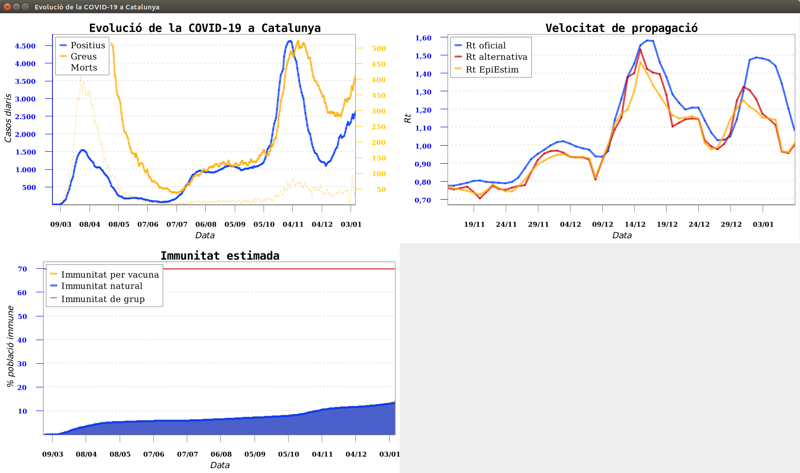

# Covid-Cat

Covid-Cat is a Java library for extracting COVID-19 data in Catalonia from 
[dadescovid.cat](https://dadescovid.cat/) website.

It provides access to the time series raw data and generates chart images too.


## Usage

### Gradle dependency
Covid-Cat is available at [Repsy](https://repsy.io/) Maven repo.

If you're using Gradle, you could add Covid-Cat as a dependency with the following steps:

1. Add `maven { url 'https://repo.repsy.io/mvn/mrtxema/public' }` to the `repositories` 
   in your `build.gradle`.
2. Add `implementation group:'cat.mrtxema.covid', name:'covid-cat', version:'1.1.0'` 
   to the `dependencies` in your `build.gradle` (replace v1.1.0 with the latest release available).

### Using Covid-Cat
The simplest way to use Covid-Cat is to use the `CovidDataManager` to display
all supported charts in a `JFrame` window:
```java
new CovidDataManager().loadData().displayAllCharts(windowTitle);
```


`CovidDataManager` also provides access to the raw data series used to generate 
the charts and to each specific chart described below.


## Charts

### CovidCasesChart
This chart shows the evolution of daily confirmed cases, serious ills and deaths.

### CovidReproductionChart
It shows the daily evolution of the R(t) parameter calculated with different methods:
* Official R(t): calculated as the average of the last 7 daily R(t) values where:
```
daily R(t) = (N(t) + N(t-1) + N(t-2)) / (N(t-5)+ N(t-6) + N(t-7))
N(t) are the daily confirmed cases
```
* Alternative R(t): calculated using an alternative method to avoid the distortion of weekends 
```
R(t) = Nw(t) / Nw(t-5)
where Nw(t) is the average of the last 7 daily confirmed cases
```
* EpiEstim R(t): EpiEstim method (Cori, A., Ferguson, N.M., Fraser, C., Cauchemez, S., 2019 [https://doi.org/10.1093/aje/kwt133]())
using the R implementation in [https://github.com/mrc-ide/EpiEstim](), with 95% confidence intervals. 
  This is calculated using sliding weekly windows, with a parametric serial interval based on 
  a mean of μsi=4.8 and standard deviation σsi=2.3. Requires R to be installed.
  
### ImmunityChart
This chart shows the daily estimation of the percentage of the population with 
immunity of the following types:
* Natural immunity after passing the disease, using data from the SARS-CoV-2 sero-Epidemiology
  study of the Spanish government (https://portalcne.isciii.es/enecovid19/)
* Immunity by vaccine


## License

[](http://www.gnu.org/licenses/gpl-3.0.en.html)

Covid-Cat is Free Software: You can use, study share and improve it at your
will. Specifically you can redistribute and/or modify it under the terms of the
[GNU General Public License](https://www.gnu.org/licenses/gpl.html) as
published by the Free Software Foundation, either version 3 of the License, or
(at your option) any later version.
